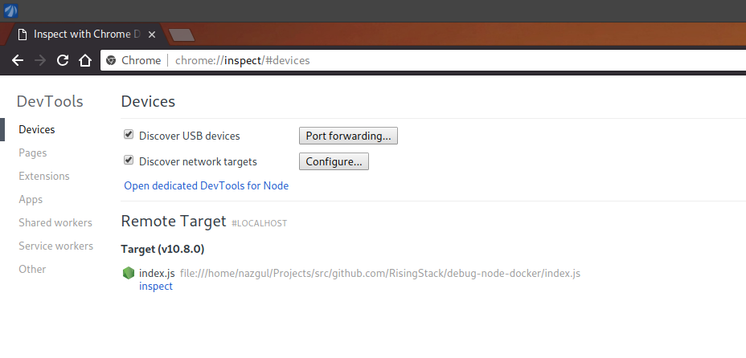
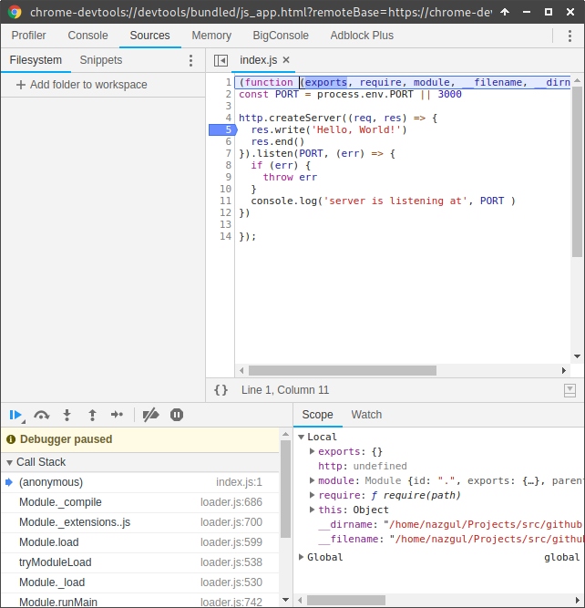
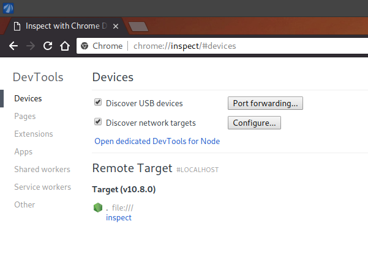
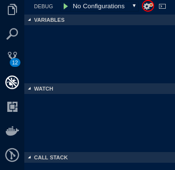
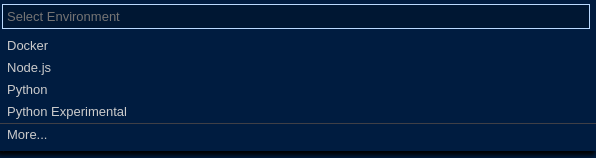
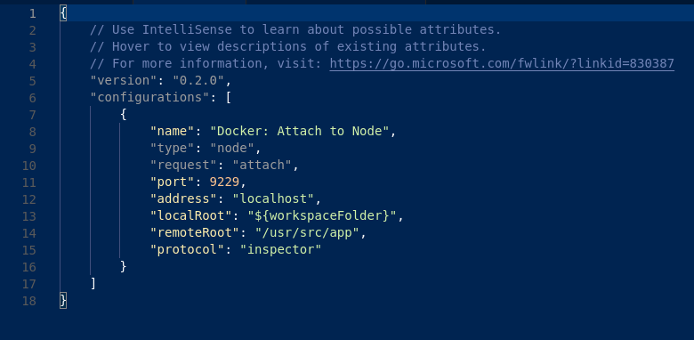
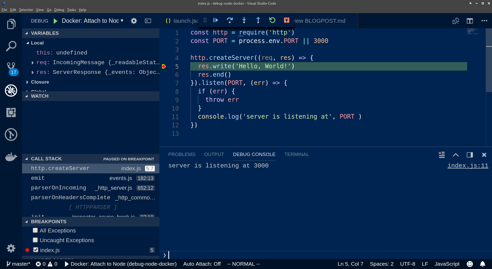

# How to debug a Node app in a Docker container

According to the Node Foundation's [one year old](https://hackernoon.com/node-js-emerging-as-the-universal-development-framework-for-a-diversity-of-applications-c2e788290f5f) survey more than 50% of Node.js users use Docker for development. While containerization in general is a very powerful tool, and here at RisingStack we always start new projects by spinning up the needed infrastructure in a docker-compose.yaml, it can be tricky to reach the envolped Node process if you don't know how to do it. 

Most of the time you can be well off running your app on your local machine and only use containers to sandbox your databases and queues, but some bugs will only show themselves when the app itself is containerized as well. In these cases it is very helpful to know how to attach a debugger to the service.

# Node inspector

If you mostly use [printf, aka caveman debugging](https://stackoverflow.com/questions/189562/what-is-the-proper-name-for-doing-debugging-by-adding-print-statements) it can be very difficult to find the right value at the right time. It gets even worse if your always have to rebuild your container image each time you add `console.log` to it. It could be a lot easier to have the image built once and jump around within it, examinig your variables while it's running. 

To run your Node app in debug mode simply add `inspect` after the `node`, something like that:

```bash
$ node inspect index.js
< Debugger listening on ws://127.0.0.1:9229/5adb6217-0757-4761-95a2-6af0955d7d25
< For help, see: https://nodejs.org/en/docs/inspector
< Debugger attached.
Break on start in index.js:1
> 1 (function (exports, require, module, __filename, __dirname) { const http = require('http')
  2 const PORT = process.env.PORT || 3000
  3 
debug> 
```

When you run your code in inspect mode it always stops at the first line, waiting for you to interact with it. But since For those who were brought up using `gdb` to debug their code this interface might be compelling. However if you are used to interact with your debugger using a GUI, you might want to open up your chrome and navigate to `chrome://inspect`.

You should see something like this:



Under remote target, click `inspect` and you'll be presented with the Chrome Developer Tools debugger.



Now you can use the debugger as you please. It's time to wrap our app in a container.

# Debugging in a container

First we'll need to create a Dockerfile,

```Dockerfile
FROM node

COPY package.json package.json  
RUN npm install

COPY . .  

EXPOSE 3000
CMD ["node", "."]
```

and a `docker-compose.yaml`

```yaml
version: '3.6'

services:
  app: 
    build: .
    ports:
      - "3000:3000" 

```

Now if you run `docker-compose up`, you'll be able to reach your service on `http://localhost:3000`.

The next step is to expose the debug port to the outside world. First let's create a `debug-compose.yaml`.

```yaml
version: '3.6'

services:
  app: 
    build: .
    ports:
      - "3000:3000" 
      - "9229:9229"
    command:
      - node
      - "--inspect-brk=0.0.0.0"
      - "." 
```

As you can see, we opened up port 9229, which is the debug port of Node.js apps. We also overrode the command we specified in the `Dockerfile`. The `--inspect-brk=0.0.0.0` argument does two different things:

1. `--inspect` tells Node that we want to run our app in debug mode.
2. by adding `-brk` we also make sure that the app stops at the first line, so we have enough time to open up the inspector
3. adding `=0.0.0.0` opens up the debugger to connections from any IP.

By default the inspector is bound to `127.0.0.1` which makes sense, as normally we don't want people from all around the world to be able to attach a debugger to our app. However, the container is a different host with a different IP then our host machine, so we won't be able to reach it. It is fine as long as we do it locally, however, we definitely don't want this to be run on a live server like this. For this reason **make sure it is a different file from your `docker-compose.yaml`**. In our case, it is called `debug-compose.yaml`. Of course, we'll need to maintain two different files, though this problem can be circumvented using a templating engine like handlebars, and we substantially reduced the risk of using the debug setup in production.

With a bit more work, you can expose the debug port from your staging cluster to your IP — but in that case, to **your IP only** — and debug issues there as well.

Also note that the port forwarding rules are enclosed in `"`-s. If you omit the the rule might not work, making it difficult to figure out why you are not able to attach the debugger to your process.

With all that said, you should be able to inspect your upp in the dev tools.



# Debugging with Visula Studio Code

It is great to use the inspector for single file issues, though it can have problems descovering all the files in your project. In these cases, it's better to attach the debugger provided by you IDE. Let's see how it's done with Visual Studio Code.

First navigate to the debug tab

  

then click the gear icon



from the popup list, select docker (make sure, you have the [Docker](https://marketplace.visualstudio.com/items?itemName=PeterJausovec.vscode-docker) extension installed)



it should generate a launch.json in the projects `.vscode` filder that looks like this:



It's almost ok, though in our case, the root of our app is the root of the container's filesystem, so we need to update that as well. The object should look like this, when you're done:

```json
{
  "name": "Docker: Attach to Node",
  "type": "node",
  "request": "attach",
  "port": 9229,
  "address": "localhost",
  "localRoot": "${workspaceFolder}",
  "remoteRoot": "/",
  "protocol": "inspector"
}
```

Now, if you hit F5 on your keyboard you'll be propmted with the debugger you got used to in VSCode. Hit F5 again, to let the server start listening. If you put a breakpoint somewhere and call the server at `htpp://localhost:3000` you should see this



# Final thoughts

Seeing how container technologies such as Kubernetes, AWS ECS, Docker Swarm and others are being more and more widespread it is clearly visible that containers are here to stay. The fact that you can have the same image run on your local machine while your developing that will eventually land on the cluster is definitely a nice thing as you can bundle the app with the configuration and deploy them together. However, finding bugs that only show themselves when the app is bundled up can be difficult when you rely on printf debugging, so even if you have not used it so far, it is definitely a good idea to become friends with debuggers and learn how to attach them to processes running in your containers. 

Happy debugging!

The idea for this post came when we ran into a bug that only arose in the container with [@fazekasda](https://github.com/fazekasda). 
